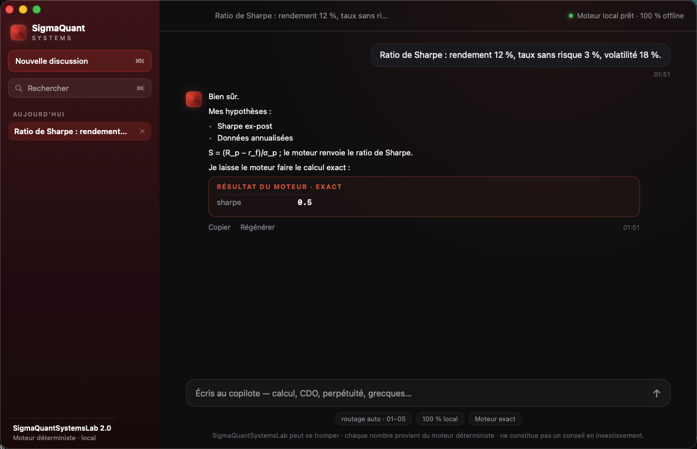

# SigmaQuant Copilot — app macOS native

**Copilote quantitatif en français**, 100 % local sur macOS. Une app **SwiftUI** native pilote un
modèle interne de 4 milliards de paramètres : il route chaque question vers la bonne méthode et
**délègue tout calcul exact à un moteur déterministe** — il ne fait jamais d'arithmétique lui-même,
donc chaque nombre affiché est exact et auditable.



## Architecture

```
SwiftUI (ChatViewModel)  ──HTTP 127.0.0.1:8765──▶  backend Python figé (server.py)
        │ spawn (Process) + SIGTERM à la fermeture          ├─▶ llama-server (llama.cpp, GGUF, DYLD)
        └────────────────────────────────────────────────── └─▶ engine/ (moteur déterministe exact)
```

L'objet `Backend` Swift lance le back-end Python (qui démarre lui-même `llama-server` sur le GGUF
embarqué) et le pilote en HTTP. Le modèle tourne 100 % offline ; chaque nombre vient du moteur
déterministe (`engine/`).

| Chemin | Rôle |
|--------|------|
| `SigmaQuant/` | sources Swift — `App` (scène + arrêt propre), `Backend` (spawn + client HTTP), `ChatViewModel` (état/persistance/santé), vues (`RootView`, `Sidebar`, `ChatView`, `MessageRow`), `Markdown`, `Theme` (identité bordeaux), `Store` (persistance JSON), `Models` |
| `backend/` | `server.py` (back-end HTTP local) + `sqsl-backend.spec` (figeage PyInstaller), `engine → ../engine` |
| `engine/` | moteur de finance déterministe (la source de vérité de chaque nombre) |
| `resources/llama/` | `llama-server` embarqué + ses dylibs |
| `prompts/system_fr.txt` | prompt système attendu par le modèle |
| `project.yml` | définition du projet (xcodegen) |
| `scripts/bundle.sh` | rend le `.app` autonome (injecte modèle + back-end figé + llama + prompt) |

**UX** : historique de conversations persisté (`~/Library/Application Support/SigmaQuantCopilot/
conversations.json`, groupé par date, recherche, renommer/supprimer), actions Copier/Régénérer +
copie des blocs de code, raccourcis ⌘N/⌘K/⌘↵, carte « Résultat du moteur · exact », prose naturelle.

## Modèle

Les poids ne sont **pas** versionnés ici (2,5 Go) — ils sont hébergés sur le Hugging Face Hub :
**[gptradeinvest/sigmaquant-copilot](https://huggingface.co/gptradeinvest/sigmaquant-copilot)**.

```bash
hf download gptradeinvest/sigmaquant-copilot sqsl-2.0-Q4_K_M.gguf --local-dir models
# -> models/sqsl-2.0-Q4_K_M.gguf  (requis avant `bash scripts/bundle.sh`)
```

## Prérequis
- **Xcode** (complet) + **xcodegen** (`brew install xcodegen`).
- Le modèle `sqsl-2.0-Q4_K_M.gguf` dans `models/` (voir ci-dessus).
- Pour le repli dev sans bundle : `/usr/bin/python3` + `numpy`/`scipy` (`pip install -r engine/requirements.txt`)
  + `llama-server` (`brew install llama.cpp`).

## Construire

```bash
xcodegen generate
DEVELOPER_DIR=/Applications/Xcode.app/Contents/Developer xcodebuild \
  -project SigmaQuantCopilot.xcodeproj -scheme SigmaQuantCopilot \
  -configuration Release -derivedDataPath build CODE_SIGNING_ALLOWED=NO build
# -> build/Build/Products/Release/SigmaQuant Copilot.app  (coquille, ~10 Mo)

bash scripts/bundle.sh   # injecte modèle + back-end figé + llama embarqué, signe ad-hoc
# -> .app autonome (~2,7 Go)
```

> **Notes** : signature **ad-hoc sans hardened runtime** (indispensable pour que le `llama-server`
> embarqué honore `DYLD_LIBRARY_PATH`). Le `Backend` Swift détecte les ressources dans
> `Contents/Resources` (mode release) sinon bascule sur l'arbre du dépôt (mode dev, build rapide).
> Non notarisée : sur une autre machine, Gatekeeper demandera une confirmation.

## Modules du moteur
- **01 — Fondations** : Black-Scholes, parité put-call, forwards, binomial risque-neutre, rente perpétuelle
- **02 — Crédit & structure par terme** : spread CDS au pair, treillis ZC, crédit amortissable, hasard/survie
- **03 — Portefeuille & exécution** : MEDAF, Sharpe, exécution optimale Almgren-Chriss
- **04 — Pricing avancé** : grecques (delta), densité de Breeden-Litzenberger, perte de tranche CDO
- **05 — Calcul** : pricing FFT Carr-Madan, calibration de modèles, ajustement Vasicek

## Licence
Sous licence **Apache 2.0** — voir [`LICENSE`](LICENSE) et [`NOTICE`](NOTICE).
Ne constitue pas un conseil en investissement. © 2026 SigmaQuantSystems.
