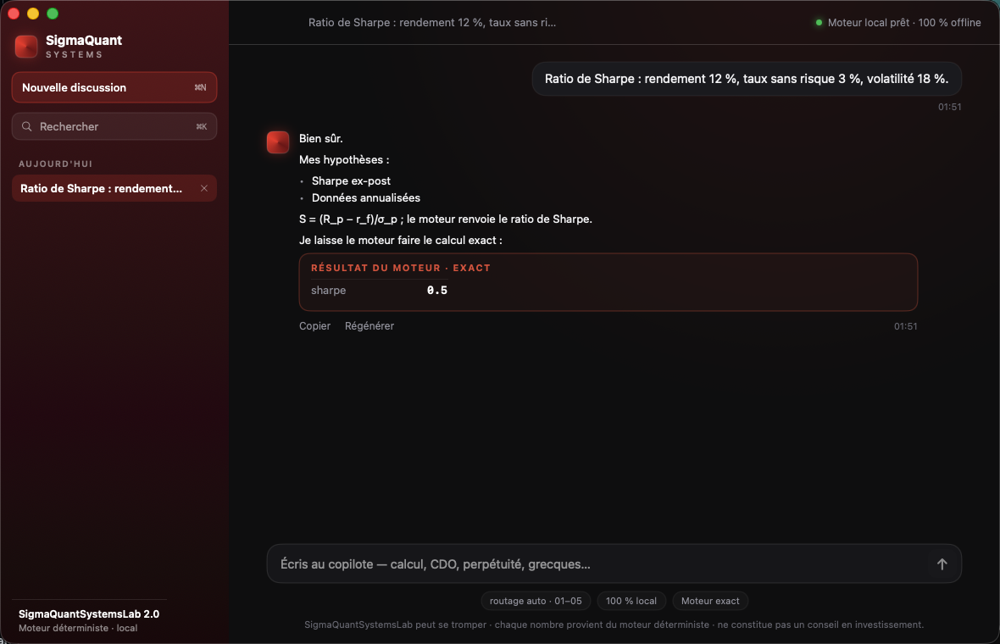

# SigmaQuant Copilot

[Français](#français) · [English](#english)

Copilote quantitatif **100 % local** sur macOS (SwiftUI + moteur déterministe).

**Fully local** macOS quant copilot (SwiftUI + deterministic engine).

---

## Français

### Présentation

Application **SwiftUI** native qui pilote un modèle local : chaque question est routée vers la bonne méthode, et **tout calcul exact est délégué à un moteur déterministe** — le modèle ne fait pas l’arithmétique lui-même, pour des résultats exacts et auditables.



### Architecture

```
SwiftUI (ChatViewModel)  ──HTTP 127.0.0.1:8765──▶  backend Python (server.py)
        │ spawn (Process) + SIGTERM à la fermeture          ├─▶ llama-server (llama.cpp, GGUF)
        └────────────────────────────────────────────────── └─▶ engine/ (moteur déterministe)
```

L’objet `Backend` Swift lance le back-end Python (qui démarre `llama-server` sur le GGUF embarqué) et le pilote en HTTP. Le modèle tourne hors ligne ; chaque nombre vient du moteur (`engine/`).

### Points clés

- 100 % local / offline sur Mac
- Interface native SwiftUI
- Calculs exacts via moteur déterministe
- Pas d’arithmétique « inventée » par le LLM

### Licence

Voir le fichier de licence du dépôt le cas échéant.

---

## English

### Overview

Native **SwiftUI** app driving a local model: each question is routed to the right method, and **all exact computation is delegated to a deterministic engine** — the model never does arithmetic itself, so every number is exact and auditable.


### Architecture

```
SwiftUI (ChatViewModel)  ──HTTP 127.0.0.1:8765──▶  Python backend (server.py)
        │ spawn (Process) + SIGTERM on quit                  ├─▶ llama-server (llama.cpp, GGUF)
        └────────────────────────────────────────────────── └─▶ engine/ (deterministic engine)
```

The Swift `Backend` object starts the Python backend (which starts `llama-server` on the bundled GGUF) and talks to it over HTTP. The model runs offline; every number comes from the engine (`engine/`).

### Highlights

- Fully local / offline on Mac
- Native SwiftUI UI
- Exact calculations via a deterministic engine
- No LLM-invented arithmetic

### License

See the repository license file if present.
